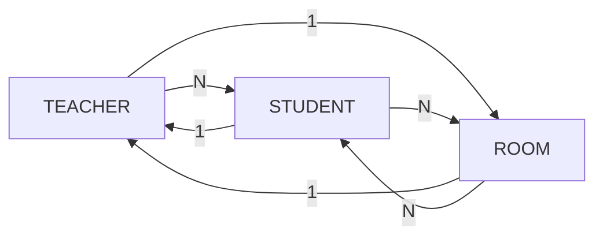
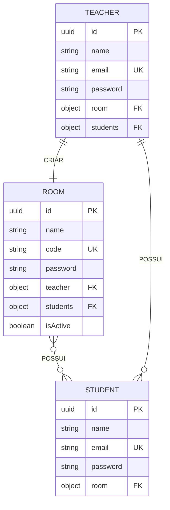

# 🏫 LiveClass | Backend Real-Time System 


## 🌟 Visão Geral

O **LiveClass** é um ecossistema de aprendizagem em tempo real desenvolvido em **Node.js**. O projeto foca na gestão dinâmica de salas de aula, permitindo que professores criem ambientes exclusivos e alunos ingressem instantaneamente através de códigos de acesso únicos via **WebSockets**.

A aplicação rompe o modelo tradicional de requisições HTTP estáticas, utilizando uma arquitetura orientada a eventos para garantir que a interação entre professor e aluno ocorra sem latência percebida.

---

## 🏗️ Arquitetura de Dados (UML)

A estrutura foi desenhada para suportar relacionamentos complexos, garantindo integridade referencial no MongoDB.


### Relacionamentos e Cardinalidade

| Entidade A | Relação | Entidade B | Regra de Negócio |
| :--- | :---: | :--- | :--- |
| **Teacher** | `1 : 1` | **Room** | Um professor possui e gerencia uma única sala ativa por vez. |
| **Teacher** | `1 : N` | **Student** | Uma professor pode estar vinculado a múltiplos alunos. |
| **Student** | `N : N` | **Room** | Um aluno pode estar vinculado a múltiplas salas simultaneamente. |

### Diagramas

 ### 📊GRAPH LR

### 📊ER DIAGRAM


---

## 🔌 Fluxo de WebSockets (Real-Time)

O coração da aplicação é o módulo de Sockets, que gerencia o ingresso seguro e a comunicação instantânea.


### Fluxo de Evento: `join_with_code`
1. **Emissão**: O cliente (Student) envia o evento com `{ studentId, roomCode }`.
2. **Validação**: O servidor consulta o MongoDB para verificar se o código da sala existe.
3. **Persistência**: O ID do aluno é injetado no array da sala (via `$addToSet`) e a sala é adicionada ao perfil do aluno.
4. **Ingresso**: O servidor executa `socket.join(roomId)`, criando um canal isolado para aquela turma.
5. **Feedback**: O aluno recebe confirmação e os demais membros recebem um alerta de novo integrante.

---

## 💻 Tecnologias Utilizadas

* **Runtime:** Node.js com **Express** (v18+)
* **Banco de Dados:** MongoDB com **Mongoose** (Modelagem de Dados).
* **Real-time:** **Socket.io** para comunicação bi-direcional.
* **Organização:** Arquitetura modular (Separation of Concerns).
* **JWT** (Autenticação)
* **Crypto** (Geração de códigos únicos)

---

## 📁 Estrutura do Projeto

```text
liveclass/
├── models/         # Schemas do Mongoose (Student, Room, Teacher)
├── controllers/    # Lógica de rotas HTTP (REST API)
├── sockets/        # Handlers de eventos em tempo real (roomSocket.js)
├── routes/         # Definição dos endpoints de API
├── services/       # Funções auxiliares (ex: gerador de códigos)
└── server.js       # Inicialização do servidor e integração Socket.io
```

---
## 📡 API Endpoints

### 🍎 Professores (Teachers)
| Método | Rota | Descrição | Acesso |
| :--- | :--- | :--- | :--- |
| **POST** | `/teachers/register` | Cadastro de novo professor | **Público** |
| **POST** | `/teachers/login` | Login e geração de Token JWT | **Público** |
| **PATCH**| `/teacher/update` | Alterar dados do professor | **Privado** (Professor)🔒 |
| **GET** | `/teacher/profile` | Lista dados do professor | **Privado** (Professor)🔒 |
| **GET** | `/teacher/rooms` | Lista dados das salas do professor | **Privado** (Professor)🔒 |
| **DELETE** | `/teacher` | Deleta o professor | **Privado** (Professor)🔒 |

### 🎓 Alunos (Students)
| Método | Rota | Descrição | Acesso |
| :--- | :--- | :--- | :--- |
| **POST** | `/students/register` | Cadastro de novo aluno | **Público**|
| **POST** | `/students/login` | Login e geração de Token JWT | **Público**|
| **GET** | `/student/profile` | Lista dados do aluno | **Privado** (Aluno)🔒 |
| **GET** | `/student/rooms` | Lista dados das salas do aluno | **Privado** (Aluno)🔒 |
| **DELETE** | `/student` | Deleta o aluno | **Privado** (Aluno)🔒 |

### 🏫 Salas (Rooms)
| Método | Rota | Descrição | Acesso |
| :--- | :--- | :--- | :--- |
| **POST** | `/rooms` | Cria uma sala (Gera código único 1:1) | **Privado** (Professor)🔒|
| **GET** | `/rooms` | Lista salas ativas (Paginado) | **Privado** (Professor)🔒|
| **GET** | `/rooms/:id` | Busca detalhes de uma sala específica | **Privado** (Professor)🔒 |
| **GET** | `/rooms/code/:code` | Busca sala pelo código de acesso | **Privado** (Professor)🔒 (Aluno)🔒 |
| **POST** | `/rooms/join/:id` | Aluno entra em uma sala |           **Privado**(Aluno)🔒|
| **PUT** | `/rooms/:id` | Atualiza dados da sala | **Privado**(Professor)(Dono)🔒 |
| **DELETE** | `/rooms/:id` | Encerra a sala (Soft Delete & Desvincula) | **Privado**(Professor)(Dono)🔒 |

---

## 🛠️ Regras de Negócio Implementadas
1. **Exclusividade 1:1**: Um professor só pode possuir uma sala `isActive: true` por vez.
2. **Clash Detection**: O sistema verifica a duplicidade de códigos aleatórios antes da persistência.
3. **Soft Delete**: Salas "deletadas" permanecem no banco com status `isActive: false` para histórico, liberando o professor para novas criações.
4. **Segurança**: Middlewares de autenticação validam se o usuário é `teacher` ou `student` antes de operações sensíveis.

## 🔐 Variáveis de Ambiente
Crie um arquivo `.env` baseado no `.env.example`:
- `PORT`: Porta do servidor (default: 3000)
- `MONGO_URI`: String de conexão do MongoDB Atlas
- `JWT_SECRET`: Chave para assinatura dos tokens


## 🛠️ Como Executar Localmente

* **1. Clone o repositório:** 
``` Bash
git clone [https://github.com/seu-usuario/liveclass.git]
```
---

* **2. Instale as dependências:** 
``` Bash
npm install
```
---

* **3. Inicie o servidor:** 
```Bash
npm start
```

---

## 🚀 Como Contribuir
 * Faça o fork do projeto.

 * Crie uma branch para sua feature (git checkout -b feature/NovaFeature).

 * Commit suas mudanças em inglês seguindo o padrão Conventional Commits.

 * Abra um Pull Request.